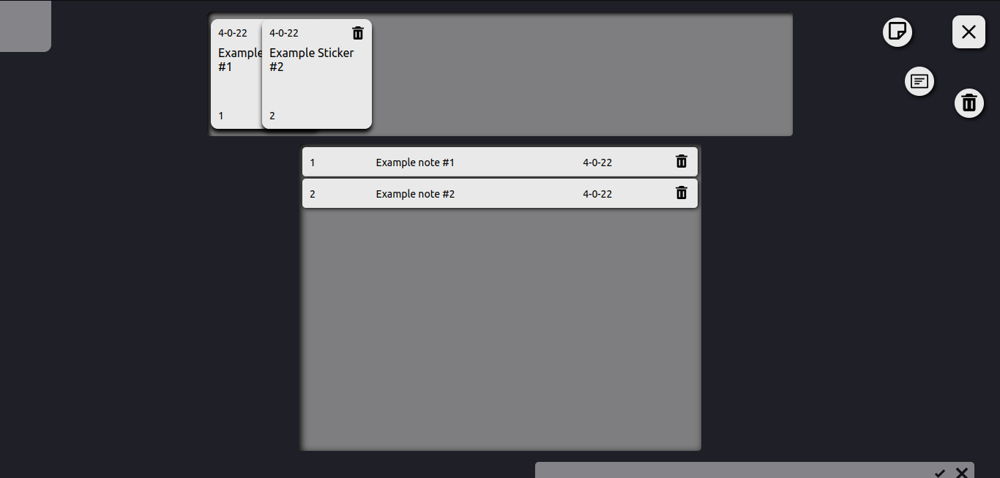
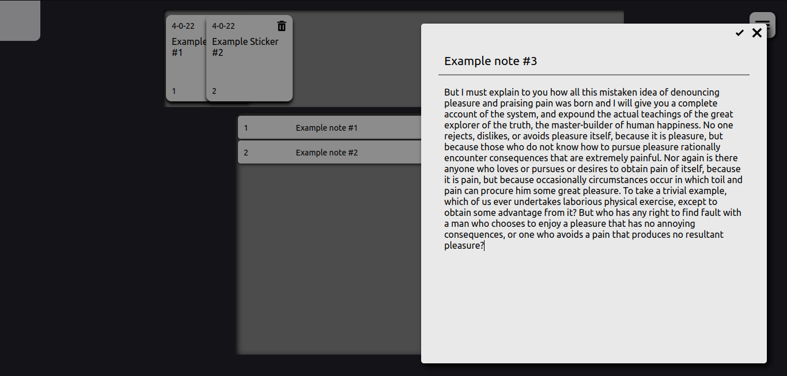
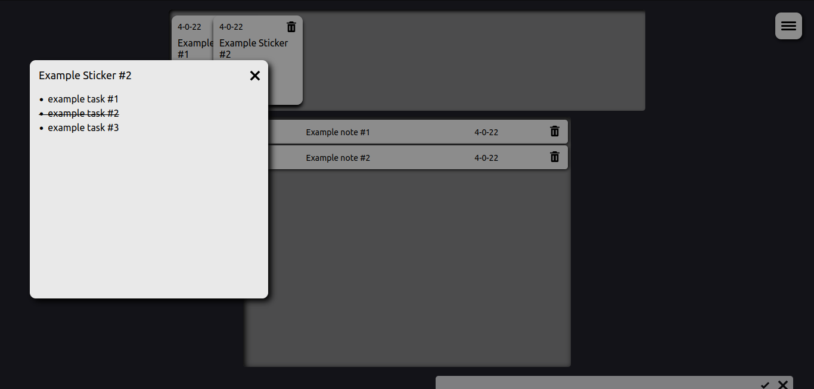

# Todo app

This is simple app for notes taking and stickers creating. Built with React and Electron for learning purposes.

## Screenshots






## Usage
```javascript
// Install dependencies
npm install

// Build app
npm run build

// Run in browser (with webpack dev server)
npm start

// Run on desktop (electron)
npm run app
```